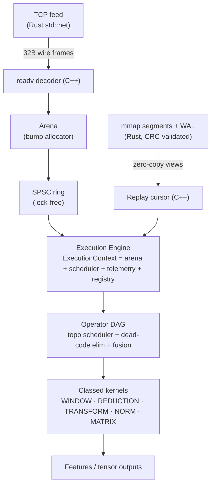

# Aegis

**High-performance execution engine powering live quantitative analytics.**

[](https://github.com/roshan-008/aegis/actions/workflows/ci.yml)


> Modern AI inference, quantitative finance pipelines, and streaming analytics all execute DAGs over memory-resident data. I built Aegis to explore how a small runtime could execute these workloads with predictable latency while remaining modular and benchmark-driven.

Aegis executes directed acyclic graphs of computational kernels over memory-resident data with predictable sub-microsecond latency. Built as a hybrid systems substrate: **C++20** owns data layout, SIMD intrinsics, memory arenas, and kernel loops; **Rust** owns file safety, WAL persistence, zero-copy mmap segment lifecycles, and network I/O.

---

## Three Workloads. One Runtime.

Aegis provides a single unified substrate for three distinct high-performance workloads:

```
┌─────────────────────────────────────────────────────────────────────────────┐
│                             AEGIS CORE RUNTIME                              │
│         Bump Arena · Lock-Free SPSC Ring · Work-Stealing Scheduler          │
└───────────────────────────────────┬─────────────────────────────────────────┘
                                    │
         ┌──────────────────────────┼──────────────────────────┐
         ▼                          ▼                          ▼
┌─────────────────┐       ┌───────────────────┐      ┌──────────────────┐
│  AI Inference   │       │   Quant Feature   │      │    Streaming     │
│       DAG       │       │     Pipeline      │      │    Analytics     │
├─────────────────┤       ├───────────────────┤      ├──────────────────┤
│ Tensor MatMul   │       │ Rolling VWAP      │      │ Sliding Windows  │
│ SoftMax & Layer │       │ EWMA & Volatility │      │ Zero-Copy Replay │
│ Tensor Graph    │       │ Orderbook Ticks   │      │ CRC32 Integrity  │
└─────────────────┘       └───────────────────┘      └──────────────────┘
```

1. **AI Inference DAG**: Executes tensor operations (MatMul, SoftMax, LayerNorm) as dataflow graphs with topological work-stealing scheduling and operator fusion.
2. **Quant Feature Pipeline**: Computes streaming financial features (Rolling Mean/Std, VWAP, EWMA) over column-oriented tick streams at 300M+ rows/sec.
3. **Streaming Analytics**: Handles real-time network feeds and zero-copy mmap disk replay with lock-free ring buffers and SIMD-accelerated data validation.

---

## Architecture & Systems Design



Every kernel is classed and dispatched through an explicit registry—matching the design of production execution engines like Arrow, Velox, and ONNX Runtime.

---

## Performance Highlights

*Tested on Apple M1 (Apple clang, `-O2 -march=native`), single host. Every optimized kernel is validated against a naive reference oracle to 1e-9 precision before benchmarking.*

| Subsystem | Baseline | Optimized | Speedup | Engineering Mechanism |
|-----------|---------:|----------:|--------:|----------------------|
| Rolling mean | 16 M rows/s | **375 M rows/s** | **23×** | O(n·w) → O(n) sliding accumulator |
| Rolling std  | 4.5 M rows/s | **298 M rows/s** | **70×** | Sliding window + shifted variance |
| Rolling vwap | 8 M rows/s | **375 M rows/s** | **44×** | Sliding dual-accumulator |
| MatMul (512²) | 1.7 GF/s | **7.9 GF/s** | **4.7×** | Cache blocking + FMA instructions |
| CRC32 Validation | 816 ms | **100 ms** | **8.2×** | Bit-by-bit → Slice-by-8 algorithm |
| Arena Allocation | ~22–95 ns | **~1.0 ns** | **~90×** | Bump allocation vs system `malloc` |
| 10M Ticks Load | 3.5 M rows/s (CSV) | **340 M rows/s** (mmap) | **~96×** | Zero-copy mmap vs text parsing |
| Skewed DAG (8×64) | 18.9 ms (barrier) | **7.7 ms** (stealing) | **2.4×** | Work-stealing dataflow dispatch |

---

## Columnar Memory Layout

```text
Row Layout (Array of Structs)          Column Layout (Struct of Arrays)
[px vol ts][px vol ts][px vol ts]      [px px px px ...] [vol vol ...] [ts ts ...]
 └─ Rolling mean over price             └─ Price is contiguous: 1 cache line holds
    strides over vol/ts (wasted)           8 prices, SIMD & prefetcher friendly
```

Aegis stores tick data in column-oriented tables (`TickTable`), ensuring that kernels access only the necessary memory channels without cache line pollution.

---

## Quick Start

Requires CMake, a C++20 compiler, and Rust (≥1.79) on macOS or Linux. No third-party Rust crates.

```bash
# Build and run test suites
cmake -S . -B build -DCMAKE_BUILD_TYPE=Release
cmake --build build -j
ctest --test-dir build --output-on-failure

# Inspect runtime kernel registry & capabilities
./build/aegis stats

# Run benchmarks
for b in rolling kernels mem runtime storage; do ./build/bench_$b; done
```

---

## Engineering Documentation

- **[Engineering Log](docs/engineering_log/README.md)**: Detailed records of architectural trade-offs, profiling findings, declined optimizations, and null results.
- **[Design Overview](DESIGN.md)**: System architecture and execution model.
- **[Benchmarks Methodology](BENCHMARKS.md)**: Benchmark environment, metrics, and regression testing guidelines.
- **[Systems Reference Map](docs/references.md)**: Comparison with production systems (jemalloc, Folly, ClickHouse, Velox).

---

## Repository Structure

```text
aegis/
├── CMakeLists.txt
├── README.md
├── DESIGN.md
├── BENCHMARKS.md
├── src/                  # C++20 core runtime
│   ├── mem/              # Arena bump allocator & pool allocators
│   ├── kernels/          # Vectorized operator kernels & registry
│   ├── runtime/          # Scheduler, work-stealing engine, trace, & task graph
│   ├── storage/          # Mmap table readers & C++ replay cursors
│   └── net/              # Network feed decoders
├── rust/                 # Rust safety layer (WAL, CRC32, TCP feed server)
├── examples/             # Inference and analytics pipeline drivers
├── test/                 # Test suites & fuzzing harnesses
├── bench/                # Benchmark suites
├── docs/                 # Engineering logs and cost cards
└── scripts/              # Build and benchmark automation
```

---

## License

MIT License.
