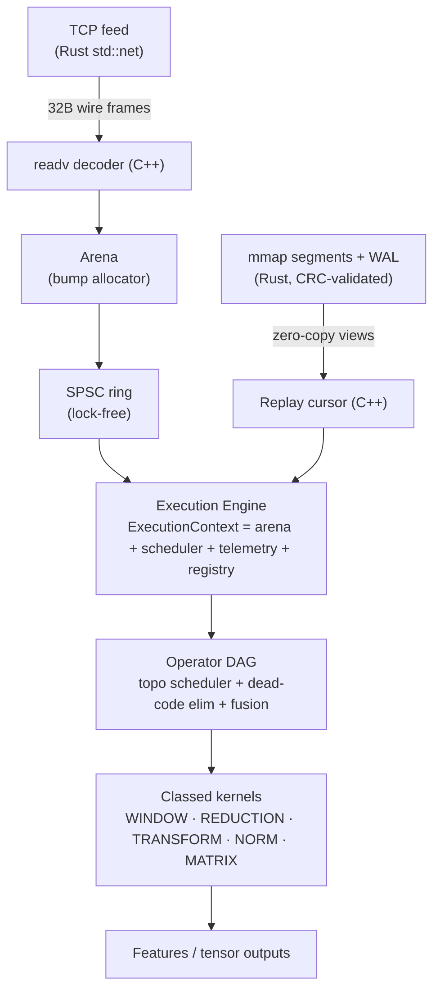

# Aegis

<!-- Badges light up once pushed to GitHub. Replace roshan-008/aegis if your slug differs. -->
[](https://github.com/roshan-008/aegis/actions/workflows/ci.yml)


**A modular execution engine for low-latency dataflow workloads.** Aegis executes
directed acyclic graphs of computational kernels over memory-resident data with
predictable latency. Streaming financial analytics and tensor inference are two
*workloads* on one substrate — a memory model, a scheduler, and a kernel registry.

Built as a hybrid: **Rust** owns everything that can be malformed or leak (files,
CRC, WAL, mmap lifetime, the TCP server); **C++20** owns everything where layout,
intrinsics, and per-tick data movement matter (arena, SPSC ring, SIMD kernels,
matmul). *There is no FFI inside a kernel loop.*

## Architecture



Every operator — rolling mean, VWAP, EMA, matmul, softmax, layernorm — is classed
and dispatched through one registry, the way Arrow, DuckDB, Velox, and ONNX
Runtime organize kernels. Analytics and MLP inference are plugins on the same
engine.

## Quick start

Requires CMake, a C++20 compiler, and Rust/Cargo (≥1.79) on 64-bit macOS or Linux.
**No third-party Rust crates.**

```sh
cmake -S . -B build -DCMAKE_BUILD_TYPE=Release
cmake --build build -j
ctest --test-dir build --output-on-failure    # 5 suites: rolling, fast, expr, runtime, rust
./build/aegis stats                            # runtime capabilities + kernel count
for b in rolling kernels mem runtime storage; do ./build/bench_$b; done
```

`AEGIS_REQUIRE_NETWORK_TEST=1 ctest` makes the Rust-TCP → C++-ring integration
test mandatory.

## Performance highlights

Apple M1, Apple clang 21, `-O2 -march=native`, single host. Every optimized op is
gated against a naive oracle to 1e-9 before its number is allowed here. Full
ledger with methodology and caveats: **[BENCHMARKS.md](BENCHMARKS.md)**.

| Subsystem | Baseline | Optimized | Speedup | How |
|-----------|---------:|----------:|--------:|-----|
| Rolling mean | 16 M rows/s | **375 M rows/s** | **23×** | O(n·w) → O(n) sliding |
| Rolling std  | 4.5 M rows/s | **298 M rows/s** | **70×** | sliding + shifted variance |
| Rolling vwap | 8 M rows/s | **375 M rows/s** | **44×** | sliding two-accumulator |
| matmul (512²) | 1.7 GF/s | **7.9 GF/s** | **4.7×** | cache blocking + FMA |
| CRC validation | 816 ms | **100 ms** | **8.2×** | bit-by-bit → slice-by-8 |
| Arena alloc | ~22–95 ns | **~1.0 ns** | **~90×** | bump vs malloc |
| Load 10M ticks | 3.5 M rows/s (CSV) | **340 M rows/s** (mmap) | **~96×** | zero-copy vs parse |
| Skewed DAG (8×64 nodes) | 18.9 ms (level barrier) | **7.7 ms** (work stealing) | **2.4×** | barrier → dataflow dispatch |

**Optimization progression** — the story each row tells (real measured steps):

```
Rolling mean:   naive 16M  ──SIMD──▶  73M  ──sliding O(n)──▶  375M rows/s
                            (+4.6×)          (+5×, algorithm beats SIMD)

CRC validation: bit-by-bit 816ms ──table──▶ 271ms ──slice-by-8──▶ 100ms/query
                                  (3.0×)             (8.2× total, byte-identical)
```

The headline lesson lives in the second row of each: *a better algorithm beats
vectorizing a worse one*, and *the standard fast form of a classic algorithm is
often far faster than the obvious one*. Both are logged with evidence.

## Memory layout — why columnar

```
Row layout (array of structs)        Column layout (struct of arrays)
[px vol ts][px vol ts][px vol ts]    [px px px px ...] [vol vol ...] [ts ts ...]
 └─ a rolling-mean over price         └─ price is contiguous: one cache line
    strides over vol/ts it never         is 8 useful prices, SIMD-friendly,
    reads — wasted bandwidth             prefetcher-friendly
```

Aegis stores ticks column-wise (`TickTable`), so a kernel touching one field
reads only that field's cache lines. This is why the rolling kernels hit memory
bandwidth and the mmap replay scan holds 99.6% of in-memory throughput.

## Engineering decisions

The repository is meant to be *auditable*, not just runnable. The reasoning
behind every optimization — hypothesis, measurement, alternatives, and the
trade-off — is recorded as decision records, including the ones that **didn't**
change anything:

- **[Engineering log](docs/engineering_log/README.md)** — a research notebook.
  Highlights: [CRC slice-by-8](docs/engineering_log/0001-crc32-slice-by-8.md)
  (shipped, 8.2×), [sliding kernels](docs/engineering_log/0002-sliding-window-kernels.md)
  (SIMD *rejected* as the wrong lever),
  [declined optimizations](docs/engineering_log/0003-declined-optimizations.md)
  (compiler already emits FMA → no intrinsics), a
  [null result](docs/engineering_log/0004-ring-false-sharing-null.md) kept
  honestly, and a [reverted change](docs/engineering_log/0005-reverted-crc-length-guard.md)
  where a fuzz test disproved my own bug hypothesis.
- **[docs/index.md](docs/index.md)** — CS concept → where it's implemented,
  measured, and reasoned about (built for interview revision).
- **[docs/references.md](docs/references.md)** — each subsystem mapped to its
  production analog (jemalloc, Folly, ClickHouse, Stevens…): borrowed vs
  deliberately declined, with reasons.
- **[docs/cost_cards.md](docs/cost_cards.md)** — one card per subsystem
  (goal / mechanism / trade-off / alternative / benchmark).

## How it's validated

- Builds clean under `-Wall -Wextra` (C++) and `clippy -D warnings` (Rust).
- **5 test suites** incl. a parser **fuzz test** (4000 malformed inputs, panic-free)
  and a live **Rust-TCP → C++-ring** integration test.
- **ASan + UBSan** clean across the whole suite, including the Rust FFI, threads,
  mmap, and TCP paths.
- **Deterministic replay:** runs record a manifest (graph fingerprint + FNV-1a
  output checksums); re-execution must match bit-for-bit, and the test proves a
  1e-9 input nudge is caught.
- **Benchmark regression gate:** benches emit JSONL headline metrics;
  `scripts/check_bench.py` hard-fails >25% regressions against
  `results/baseline-apple-m1.jsonl` on the baseline host (advisory on CI).
- **Execution tracing:** both schedulers emit Chrome/Perfetto trace JSON with
  per-node spans, worker lanes, and a measured critical path.
- **[CI](.github/workflows/ci.yml)** (Linux) runs build, tests, sanitizers (+ LSan),
  clang-tidy, clippy, and a benchmark smoke on every push.

## Repository map

```
src/        column · rolling(_fast) · simd · parallel · ring_buffer · mmap_table · span · expr
  mem/      arena · fixed_pool · alloc_counter
  kernels/  core (12 kernels) · registry (classed dispatch)
  runtime/  context (ExecutionContext) · task_graph · optimizer · scheduler · work_steal · worker_pool · streaming · observability · trace (Chrome/Perfetto) · replay (run manifests)
  storage/  segment · reader · cursor · rust_bridge
  net/      feed · rust_server
rust/       storage / CRC / WAL / mmap / recovery + aegis CLI + feed_server
examples/   AnalyticsPipeline + MlpPipeline (same scheduler API)
test/       test_rolling · test_fast · test_expr · test_runtime (+ Rust unit/fuzz)
bench/      bench_{rolling,ring,streaming,parallel,mmap,kernels,mem,runtime,scheduler,storage} + harness
scripts/    build · bench · check_bench.py (regression gate vs results/baseline-*.jsonl)
docs/       engineering_log/ · index.md · references.md · cost_cards.md · BENCHMARKS · DESIGN · profiling
```

## Roadmap

| Milestone | Status |
|-----------|--------|
| R1 — memory + 12 classed kernels + registry | ✅ shipped |
| R2 — DAG scheduler + optimizer + bounded streaming | ✅ shipped |
| R3 — Rust WAL/segments + zero-copy mmap replay | ✅ shipped |
| R4 — TCP feed + copy accounting + fusion + examples | ✅ shipped |
| R5 — work-stealing scheduler, Chrome-trace observability, deterministic replay manifests, benchmark regression gate | ✅ shipped |
| Linux/x86 pass — LSan leaks, `perf`/roofline, AVX2 vs NEON | ⏳ open (needs the CI host) |
| Latency percentiles under thread pinning; kill-9 fault injection | ⏳ open |

Open items are open questions in the engineering log, not silent gaps — they need
a Linux host with `perf` and thread affinity that macOS/arm64 can't provide.

## What is *not* here (honestly)

No flamegraphs or `perf`/cachegrind artifacts yet — they can't be generated
cleanly on macOS/arm64, so they're deferred to the Linux CI pass rather than
faked. No per-commit benchmark history chart — this is early history, and a fake
trend line would violate the project's one rule: **every number is measured, and
negative or unmeasurable results are recorded as such.**

See also [DESIGN.md](DESIGN.md) and [docs/copy_map.md](docs/copy_map.md).
